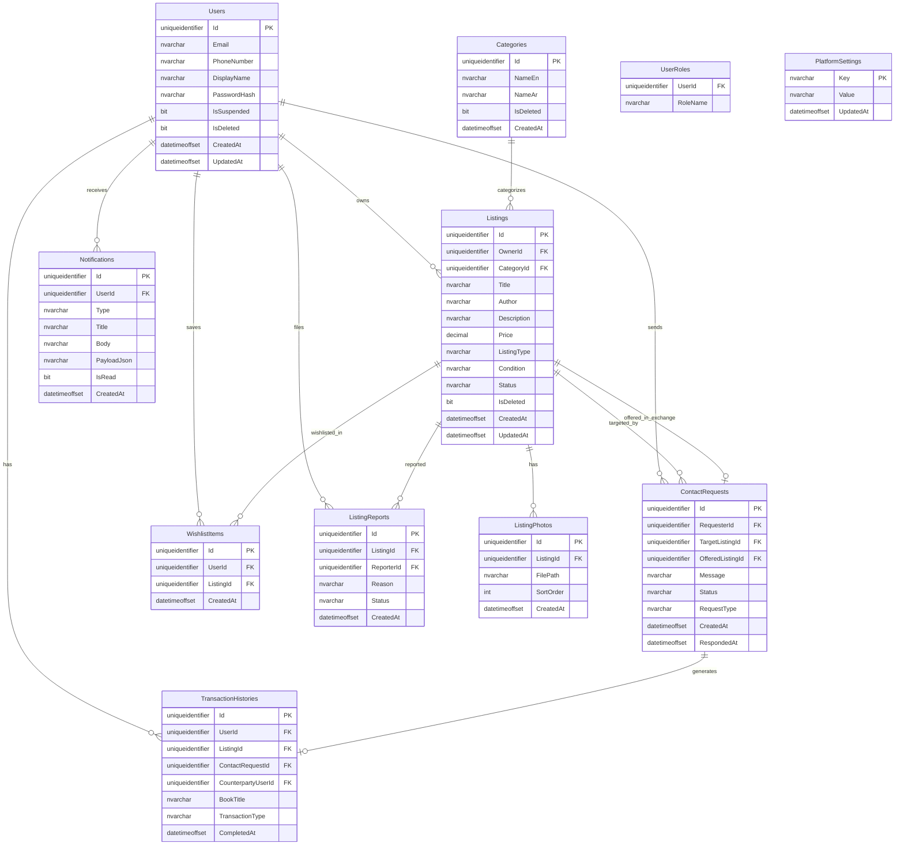

# ERD — Peer-to-Peer Book Exchange System (Kitab)

**Database:** SQL Server  
**ORM:** Entity Framework Core 8 Code First  
**ID strategy:** `uniqueidentifier` (GUID) for all primary keys

---

## Entity Relationship Diagram



---

## Table Specifications

### Users

Extends ASP.NET Core Identity `IdentityUser<Guid>` or mirrors its fields.

| Column | Type | Constraints | Notes |
|--------|------|-------------|-------|
| Id | uniqueidentifier | PK | |
| Email | nvarchar(256) | UNIQUE, nullable | Login identifier |
| PhoneNumber | nvarchar(20) | UNIQUE, nullable | Alternative login |
| DisplayName | nvarchar(100) | NOT NULL | Shown in seller preview |
| PasswordHash | nvarchar | NOT NULL | Identity-managed |
| IsSuspended | bit | DEFAULT 0 | Blocks login |
| IsDeleted | bit | DEFAULT 0 | Soft delete |
| CreatedAt | datetimeoffset | NOT NULL | UTC |
| UpdatedAt | datetimeoffset | NULL | UTC |

**Roles:** `AspNetUserRoles` — values `User`, `Admin`

---

### Categories

| Column | Type | Constraints | Notes |
|--------|------|-------------|-------|
| Id | uniqueidentifier | PK | |
| NameEn | nvarchar(100) | NOT NULL | |
| NameAr | nvarchar(100) | NOT NULL | Bilingual |
| IsDeleted | bit | DEFAULT 0 | |
| CreatedAt | datetimeoffset | NOT NULL | |

**Business rule:** Cannot hard-delete if active listings exist (FR-40).

---

### Listings

| Column | Type | Constraints | Notes |
|--------|------|-------------|-------|
| Id | uniqueidentifier | PK | |
| OwnerId | uniqueidentifier | FK → Users | |
| CategoryId | uniqueidentifier | FK → Categories | |
| Title | nvarchar(200) | NOT NULL | |
| Author | nvarchar(200) | NOT NULL | |
| Description | nvarchar(2000) | NULL | |
| Price | decimal(10,2) | NULL | Required when ListingType = ForSale |
| ListingType | nvarchar(20) | NOT NULL | `ForSale`, `ForExchange` |
| Condition | nvarchar(20) | NOT NULL | `New`, `Good`, `Acceptable`, `Poor` |
| Status | nvarchar(20) | NOT NULL | `Available`, `Sold`, `Exchanged`, `Unavailable` |
| IsDeleted | bit | DEFAULT 0 | |
| CreatedAt | datetimeoffset | NOT NULL | |
| UpdatedAt | datetimeoffset | NULL | |

**Indexes:**
- `IX_Listings_Status_CreatedAt` (Status, CreatedAt DESC)
- `IX_Listings_CategoryId`
- `IX_Listings_OwnerId`

---

### ListingPhotos

| Column | Type | Constraints | Notes |
|--------|------|-------------|-------|
| Id | uniqueidentifier | PK | |
| ListingId | uniqueidentifier | FK → Listings, CASCADE DELETE | |
| FilePath | nvarchar(500) | NOT NULL | Relative URL or blob path |
| SortOrder | int | NOT NULL | Gallery order |
| CreatedAt | datetimeoffset | NOT NULL | |

**Business rule:** Max 5 photos per listing (enforced in application + PlatformSettings).

---

### ContactRequests

| Column | Type | Constraints | Notes |
|--------|------|-------------|-------|
| Id | uniqueidentifier | PK | |
| RequesterId | uniqueidentifier | FK → Users | |
| TargetListingId | uniqueidentifier | FK → Listings | Book being requested |
| OfferedListingId | uniqueidentifier | FK → Listings, NULL | Required for exchange |
| Message | nvarchar(500) | NULL | Optional contact message |
| Status | nvarchar(20) | NOT NULL | `Pending`, `Accepted`, `Rejected` |
| RequestType | nvarchar(20) | NOT NULL | `Contact`, `Exchange` |
| CreatedAt | datetimeoffset | NOT NULL | |
| RespondedAt | datetimeoffset | NULL | Set on accept/reject |

**Indexes:**
- `IX_ContactRequests_TargetListingId_Status`
- `IX_ContactRequests_RequesterId`

**Business rules:**
- Requester cannot target own listing (FR-25)
- OfferedListing must be Available + ForExchange for exchange type (FR-26)
- Terminal states: Accepted, Rejected — no updates after

---

### WishlistItems

| Column | Type | Constraints | Notes |
|--------|------|-------------|-------|
| Id | uniqueidentifier | PK | |
| UserId | uniqueidentifier | FK → Users | |
| ListingId | uniqueidentifier | FK → Listings | |
| CreatedAt | datetimeoffset | NOT NULL | |

**Unique constraint:** `UQ_WishlistItems_UserId_ListingId`

---

### TransactionHistories

| Column | Type | Constraints | Notes |
|--------|------|-------------|-------|
| Id | uniqueidentifier | PK | |
| UserId | uniqueidentifier | FK → Users | Party viewing history |
| ListingId | uniqueidentifier | FK → Listings | |
| ContactRequestId | uniqueidentifier | FK → ContactRequests | Source request |
| CounterpartyUserId | uniqueidentifier | FK → Users | Other party |
| BookTitle | nvarchar(200) | NOT NULL | Denormalized for display |
| TransactionType | nvarchar(20) | NOT NULL | `Sale`, `Exchange` |
| CompletedAt | datetimeoffset | NOT NULL | |

**Note:** On accept, insert one row per party (FR-34).

---

### Notifications

| Column | Type | Constraints | Notes |
|--------|------|-------------|-------|
| Id | uniqueidentifier | PK | |
| UserId | uniqueidentifier | FK → Users | |
| Type | nvarchar(50) | NOT NULL | `RequestReceived`, `RequestAccepted`, `RequestRejected`, `WishlistAvailable` |
| Title | nvarchar(200) | NOT NULL | |
| Body | nvarchar(500) | NOT NULL | |
| PayloadJson | nvarchar(max) | NULL | e.g. `{ "requestId": "...", "listingId": "..." }` |
| IsRead | bit | DEFAULT 0 | |
| CreatedAt | datetimeoffset | NOT NULL | |

**Index:** `IX_Notifications_UserId_IsRead_CreatedAt`

---

### ListingReports

| Column | Type | Constraints | Notes |
|--------|------|-------------|-------|
| Id | uniqueidentifier | PK | |
| ListingId | uniqueidentifier | FK → Listings | |
| ReporterId | uniqueidentifier | FK → Users | |
| Reason | nvarchar(500) | NOT NULL | |
| Status | nvarchar(20) | NOT NULL | `Open`, `Reviewed`, `Dismissed` |
| CreatedAt | datetimeoffset | NOT NULL | |

---

### PlatformSettings

| Column | Type | Constraints | Notes |
|--------|------|-------------|-------|
| Key | nvarchar(100) | PK | e.g. `MaxPhotosPerListing` |
| Value | nvarchar(500) | NOT NULL | e.g. `5` |
| UpdatedAt | datetimeoffset | NOT NULL | |

**Seed data:**
- `MaxPhotosPerListing` = `5`
- `MaxPhotoSizeMb` = `5`
- `ListingRulesText` = (admin-configurable)

---

## Enum Reference

```csharp
public enum ListingType { ForSale, ForExchange }
public enum ListingCondition { New, Good, Acceptable, Poor }
public enum ListingStatus { Available, Sold, Exchanged, Unavailable }
public enum RequestStatus { Pending, Accepted, Rejected }
public enum RequestType { Contact, Exchange }
public enum TransactionType { Sale, Exchange }
public enum NotificationType { RequestReceived, RequestAccepted, RequestRejected, WishlistAvailable }
public enum ReportStatus { Open, Reviewed, Dismissed }
```

Store as `nvarchar` in SQL for readability and EF string conversion.

---

## Sample Seed Data (Development)

| Entity | Sample |
|--------|--------|
| Admin user | admin@kitab.local / Admin role |
| Categories | Fiction, Science, Children's, Textbooks |
| Test users | layla@test.local, omar@test.local |
| Listings | 10–15 mixed sale/exchange listings with photos |

---

*Companion document: `architecture-peer-to-peer-book-exchange.md`*
